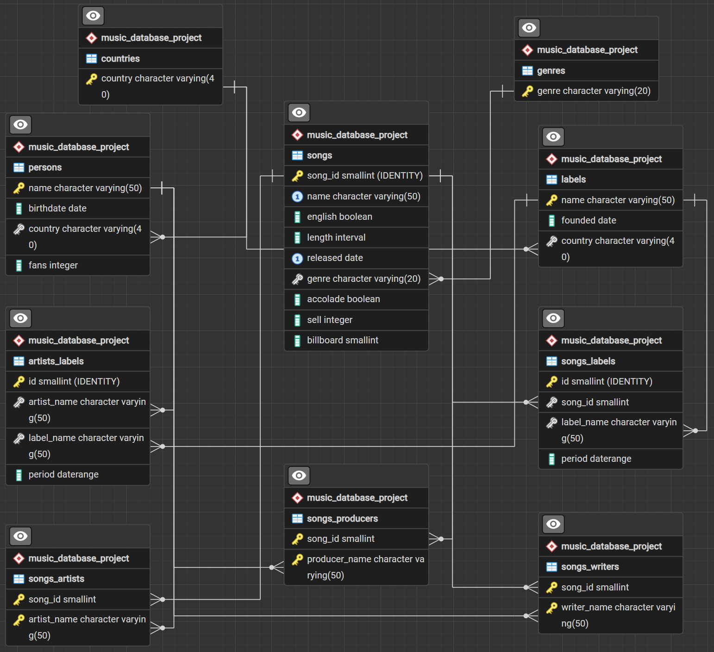
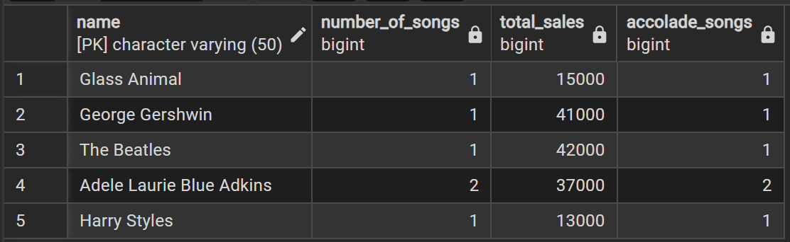
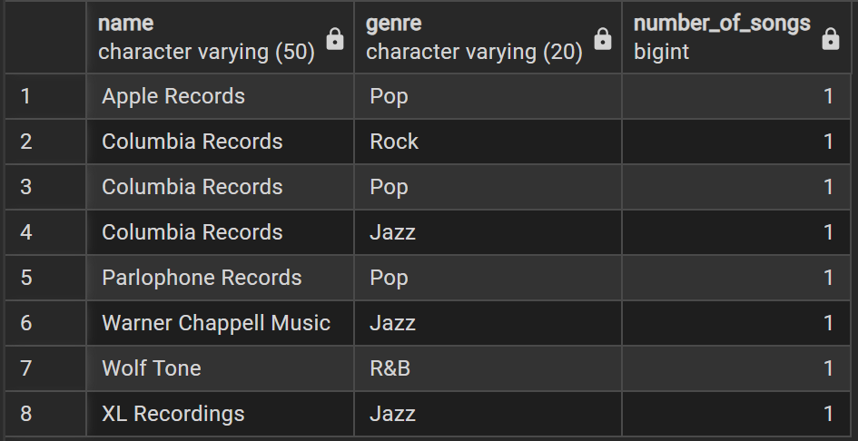
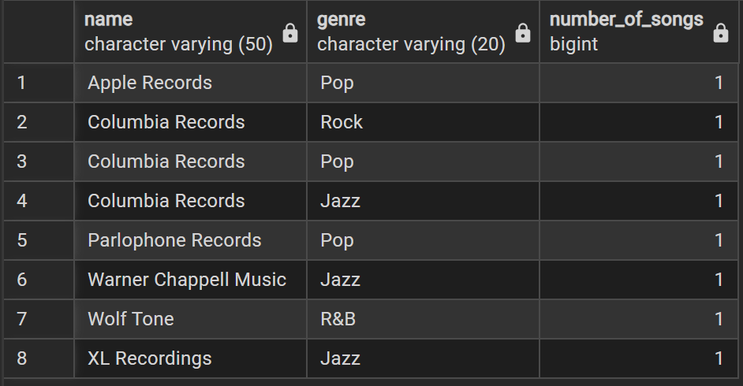
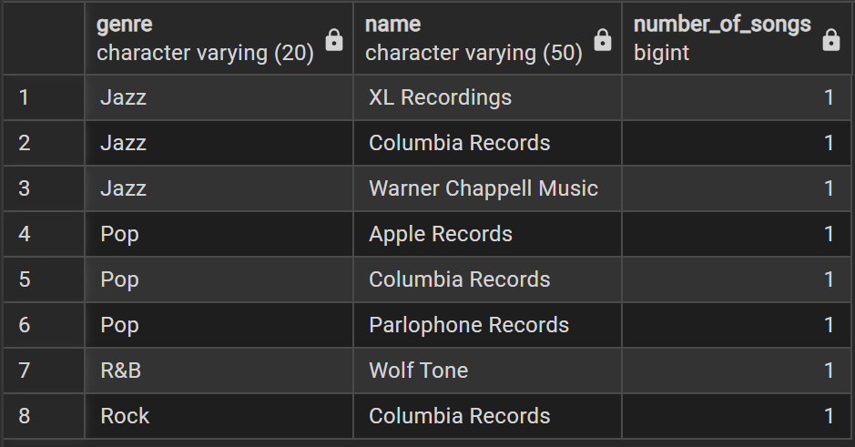
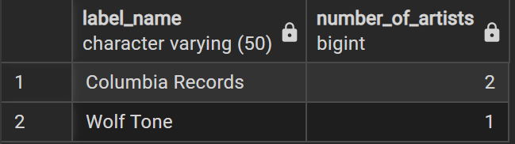

# 🎵 Music Database Management System (PostgreSQL)

A relational database management system built with PostgreSQL for managing music industry data. This project demonstrates database design, normalization, relational modeling, PostgreSQL-specific features, indexing strategies, and advanced SQL analysis through a realistic business scenario.

---

## Highlights

- Designed a normalized relational database with **10 interconnected tables**
- Implemented **Primary Keys, Foreign Keys, CHECK, UNIQUE, and EXCLUDE constraints**
- Modeled historical artist-label and song-label relationships using PostgreSQL **DATERANGE**
- Optimized query performance through indexing on frequently joined columns
- Developed analytical SQL queries using **JOINs, CTEs, Window Functions, and Aggregate Functions**

---

# Project Overview

The objective of this project is to design and implement a relational database capable of managing data within the music industry.

The database stores information about:

- Songs
- Artists
- Songwriters
- Producers
- Record Labels
- Genres
- Countries

In addition to supporting daily data management, the database enables analytical reporting through advanced SQL queries while maintaining referential integrity and historical relationship tracking.

---

# Entity Relationship Diagram

The following ER diagram illustrates the database schema.

<p align="center">

</p>

---

# Database Design

The database contains ten normalized tables.

| Table | Description |
|------|-------------|
| countries | Country reference table |
| genres | Music genre reference table |
| persons | Artists, writers, and producers |
| labels | Record label information |
| songs | Song information |
| songs_artists | Song–Artist relationship |
| songs_writers | Song–Writer relationship |
| songs_producers | Song–Producer relationship |
| songs_labels | Historical song-label ownership |
| artists_labels | Historical artist-label contracts |

Several many-to-many relationships are implemented through bridge tables to reduce redundancy and improve data consistency.

Historical contracts and ownership are modeled using PostgreSQL `DATERANGE`.

---

# PostgreSQL Features

### Database Design

- Third Normal Form (3NF)
- Primary Keys
- Foreign Keys
- Referential Integrity
- Bridge Tables

### Constraints

- CHECK Constraints
- UNIQUE Constraints
- EXCLUDE USING GIST
- NOT NULL Constraints
- IDENTITY Columns

### PostgreSQL Features

- DATERANGE
- INTERVAL
- BOOLEAN
- DATE

### Performance Optimization

- Indexes on foreign keys
- Optimized JOIN performance

---

# SQL Techniques Demonstrated

This project demonstrates practical SQL techniques including:

- INNER JOIN
- LEFT JOIN
- Aggregate Functions
- GROUP BY
- Common Table Expressions (CTE)
- Window Functions
- ROW_NUMBER()
- CASE Expressions
- INSERT
- UPDATE
- PostgreSQL DATERANGE

---

# Example Queries

## 1. Artist Performance Summary

Calculates the number of songs, cumulative sales, and award-winning songs for each artist.

<p align="center">

</p>

---

## 2. Current Artist and Song Labels

Displays each artist's current record label together with the labels currently associated with their songs.

<p align="center">

</p>

---

## 3. Songs by Label and Genre

Analyzes the distribution of songs across record labels and music genres.

<p align="center">

</p>

---

## 4. Label Distribution Within Each Genre

Summarizes the number of songs owned by each record label for every genre.

<p align="center">

</p>

---

## 5. Current Artists Signed to Each Label

Counts the number of artists currently signed to each record label.

<p align="center">

</p>

---

## 6. Artist and Song Label Consistency

Compares artists' current labels with the labels currently owning their songs to identify cross-label collaborations or ownership differences.

<p align="center">

</p>

---

# Repository Structure

```text
Music-Database-Management-System
│
├── README.md
├── 01_create_tables.sql
├── 02_foreign_keys.sql
├── 03_indexes.sql
├── 04_insert_data.sql
├── 05_advanced_queries.sql
│
└── images
    ├── ERD.png
    ├── QUERY1.png
    ├── QUERY2.png
    ├── QUERY3.png
    ├── QUERY4.png
    ├── QUERY5.png
    └── QUERY6.png
```

---

# Future Improvements

- Develop stored procedures for common business operations.
- Implement triggers for automatic auditing and validation.
- Create reusable database views for reporting.
- Analyze query execution plans to further optimize performance.
- Connect the database to Power BI or Tableau for interactive dashboards.

---

# Project Background

This project was originally developed as part of a graduate-level Database Systems course at Tufts University and was subsequently refactored, documented, and expanded into a portfolio project.

---

# Author

**Chenyin Luo**

M.S. in Data Analytics  
Tufts University

GitHub: https://github.com/chenyin9808
